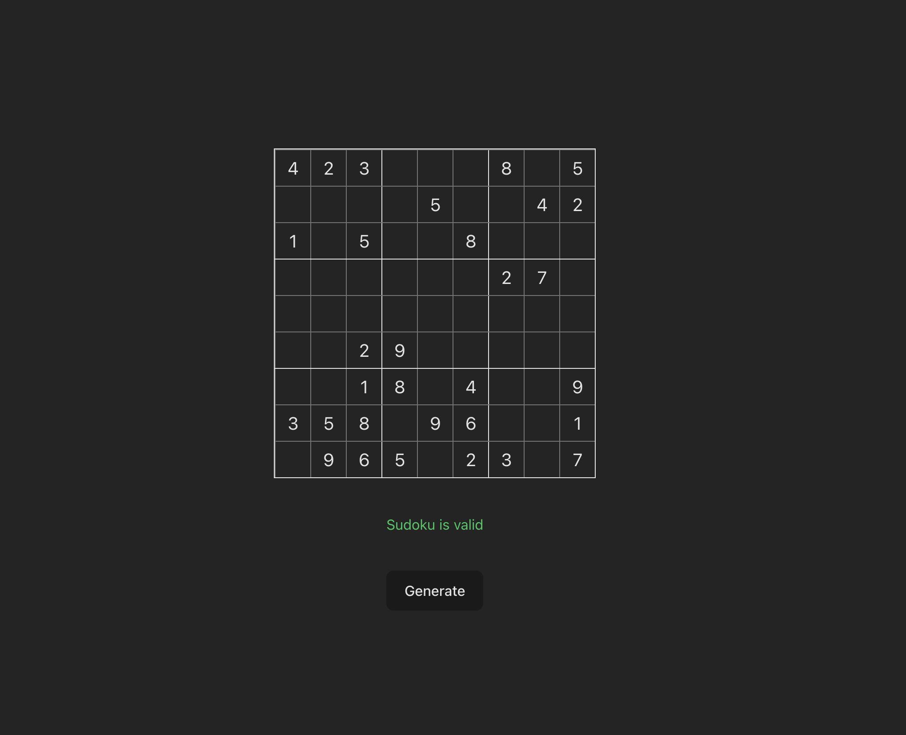

# Sudoku Game

A Sudoku game built with **React**, **TypeScript**, and **Vite**.



## Features

- **Generate** a random puzzle with pre-filled clues locked in place
- **Reset** your answers back to the generated puzzle at any time
- **Real-time conflict highlighting** — duplicate values dim the affected row, column, or box, and mark the exact conflicting cells with a red border
- **Completion validation** — shows whether your solution is valid once every cell is filled
- Only digits 1–9 accepted; `Backspace`/`Delete` clears a cell

## Getting Started

### Install dependencies

```bash
pnpm install
```

### Run the development server

```bash
pnpm dev
```

The app will be available at `http://localhost:5173`.

### Build for production

```bash
pnpm build
```

### Deploy to GitHub Pages

```bash
pnpm run deploy
```
